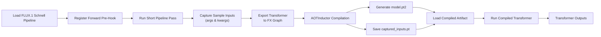

# Ahead-of-Time (AOT) Compilation of FLUX.1 Schnell Transformer

## Overview

The objective of this work is to optimize the inference of the **FLUX.1 Schnell** model by compiling its transformer using **PyTorch AOTInductor**. Instead of executing the transformer through the Python runtime, the transformer is exported into a static computation graph and compiled into optimized native code for efficient inference.

---

## AOT Compilation Workflow

> **Note:** The flowchart below renders on GitHub, VS Code Markdown Preview, and GitLab.

---

## Workflow Description

### 1. Sample Input Capture
A forward pre-hook is registered on the transformer to capture the **sample inputs** required for export. These captured inputs are then reused during the export process.

### 2. Transformer Export
The transformer is exported using **Torch Export**, producing an **FX graph**.

### 3. AOT Compilation
The FX graph is compiled using **PyTorch AOTInductor**, generating:
- `model.pt2` (compiled C++ + Triton artifact)
- `captured_inputs.pt` (saved sample inputs)

### 4. Compiled Inference
The compiled artifact is loaded and executed using the saved sample inputs.

---

## Current Status

### Completed
- Captured sample inputs using a forward pre-hook.
- Exported the transformer to an FX graph.
- Compiled the exported graph using AOTInductor.
- Generated and loaded the compiled artifact.
- Successfully executed the compiled transformer independently.

### Current Challenge
The compiled transformer executes correctly in isolation; however, integration back into the original Diffusers pipeline to generate the final image is still under development.

---

## Performance Summary

| Metric | Value |
| :--- | :--- |
| **Model** | FLUX.1 Schnell Transformer |
| **Export Method** | Torch Export |
| **Compiler** | PyTorch AOTInductor |
| **Compiled Artifact** | `model.pt2` (C++ + Triton kernels) |
| **Sample Input Capture** | Forward Pre-Hook |
| **Transformer Inference Time** | **≈ 2.5 s** |
| **Peak GPU VRAM** | **≈ 11.24 GB** |
| **Pipeline Integration** | In Progress |
